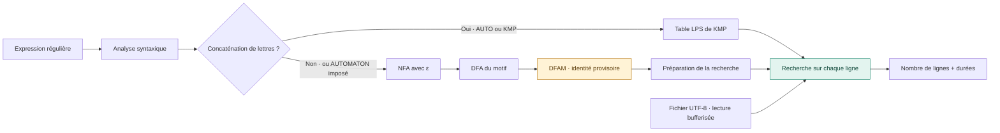
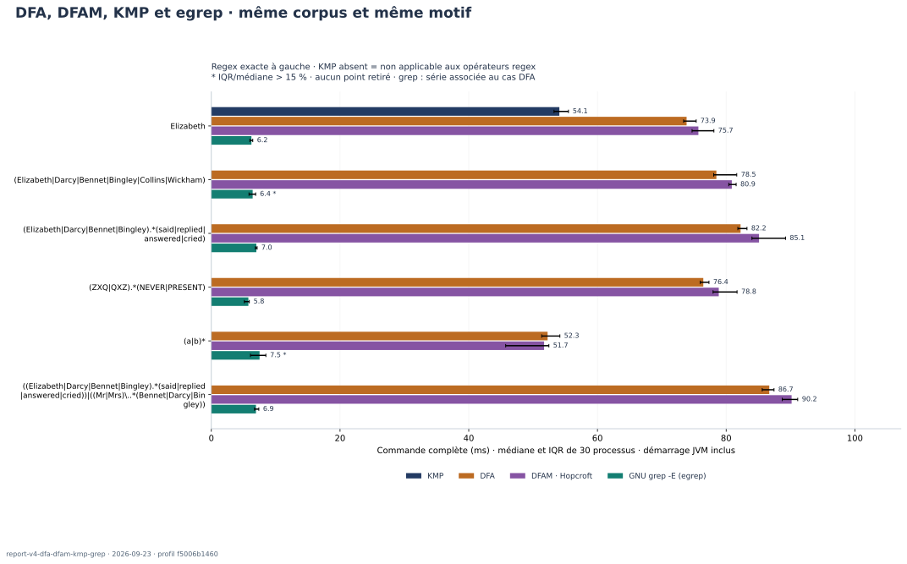

<div align="center">

# REGEX SEARCH

### De l’expression régulière à la recherche dans un fichier

**Projet algorithmique DAAR · Sorbonne · 2026**

[Prise en main](#prise-en-main) · [Rapport technique](#rapport) · [Résultats expérimentaux](docs/05-experiences.md) · [Sujet](src/main/java/com/sorbonne/specifications/daar_projet1.pdf)

</div>

---

Une commande comme `grep -E 'Elizabeth|Darcy' roman.txt` tient sur une ligne. Derrière cette ligne, il faut pourtant répondre à plusieurs questions : comment représenter le motif ? Comment reconnaître une occurrence au milieu du texte ? Que faut-il préparer une seule fois, et que faut-il recommencer à chaque ligne ? À quel moment le coût de préparation devient-il plus important que la recherche elle-même ?

Ce projet reprend ces questions en construisant un moteur de recherche textuelle en Java. Le point de départ est une expression régulière et un fichier UTF-8. Le résultat recherché est l’ensemble des lignes contenant une occurrence du motif. Dans la version actuelle orientée benchmark, le programme **compte ces lignes** : il ne les affiche pas encore comme le ferait la commande interactive `egrep`.

Deux chemins sont disponibles. Un motif littéral, comme `Elizabeth`, est recherché par **Knuth–Morris–Pratt**. Un motif qui utilise une alternative, une étoile ou un point universel passe par un **arbre syntaxique**, un **automate non déterministe avec transitions ε**, puis un **automate déterministe**. La préparation transforme ensuite cet automate de reconnaissance en un moteur capable de trouver une occurrence à n’importe quelle position d’une ligne.

L’intérêt du travail tient autant aux résultats qu’aux distinctions à faire pour les obtenir. Reconnaître un mot entier ne suffit pas à trouver ce mot dans une phrase. Une recherche linéaire peut nécessiter une préparation coûteuse. Un benchmark Java mesuré après le démarrage de la JVM ne se compare pas directement au temps complet d’une commande `grep`. Ces points guident l’implémentation, les tests et le protocole expérimental présenté dans ce dépôt.

> **État de cette version.** La lecture des fichiers, KMP, les constructions NFA/DFA et la recherche préparée fonctionnent. `DFAM.minimize()` est un point d’intégration : il renvoie encore le DFA reçu. Les mesures publiées ne décrivent donc **pas** une chaîne avec minimisation effective. La conformité au sujet reste à compléter sur ce point et sur l’affichage des lignes.

<a id="rapport"></a>

## Parcours de lecture

| Partie | Ce qu’on y trouve |
| :--- | :--- |
| **01 — [Installer et utiliser](docs/01-utilisation.md)** | Prérequis, scripts, exemples, binaire JAR et résolution des erreurs courantes |
| **02 — [Définir le problème et l’architecture](docs/02-conception.md)** | Contrat de recherche, syntaxe supportée, structures de données et partage des responsabilités |
| **03 — [Comprendre les algorithmes](docs/03-algorithmes.md)** | Construction des automates, fermetures ε, point universel, recherche de facteur, KMP et complexités |
| **04 — [Vérifier les résultats](docs/04-validation.md)** | Tests simples, cas limites, génération reproductible, oracles et limites de la couverture |
| **05 — [Mesurer et discuter](docs/05-experiences.md)** | Protocole, campagne réelle, graphiques, données brutes et limites des conclusions |
| **06 — [Terminer et préparer le rendu](docs/06-perspectives.md)** | Travail restant, évolutions possibles et plan de synthèse conforme au sujet |
| **Références — [Sources et bibliographie](docs/references.md)** | Sujet, chapitre fourni et documentation technique utilisée |

Le README permet de démarrer sans lire tout le rapport. Les chapitres servent ensuite à suivre une décision jusqu’au code ou à vérifier un résultat jusqu’au CSV qui l’a produit.

<a id="prise-en-main"></a>

## 01 · Prérequis et première exécution

| Outil | Version / usage |
| :--- | :--- |
| **JDK** | Java **21 ou supérieur**, avec `java` et `javac` ; version cible définie dans `pom.xml` |
| **Maven** | **3.6.3 ou supérieur** pour compiler, résoudre les dépendances et exécuter JUnit |
| **Bash** | Point d’entrée des scripts ; utilisable sous Linux, macOS ou un environnement Linux tel que WSL |
| **Python** | **3.9 ou supérieur**, bibliothèque standard pour les comparaisons et leurs tests |
| **GNU grep** | Nécessaire uniquement pour la comparaison ; `ggrep` est recherché en priorité sur macOS |
| **Locale UTF-8** | Nécessaire pour donner le même sens aux caractères dans la comparaison |

JUnit **6.1.3** est une dépendance de test téléchargée par Maven. Le moteur Java n’appelle ni `grep` ni `java.util.regex` pour effectuer ses recherches. Matplotlib sert uniquement à régénérer les figures du rapport ; il n’est requis ni pour lancer le moteur ni pour exécuter les tests ordinaires.

Depuis la racine du projet :

```bash
# 1. Nettoyer, compiler et lancer les tests Java et Python.
./run.sh

# 2. Chercher une regex dans un fichier et afficher le détail des durées Java.
./scripts/benchmark.sh Samples/PrideAndPrejudice.txt 'Elizabeth|Darcy' AUTO

# 3. Comparer les commandes complètes Java et GNU grep -E.
./scripts/compare-egrep.sh Samples/PrideAndPrejudice.txt \
  'Elizabeth|Darcy' --runs 20 --warmups 3
```

Le fichier fourni donne **1 050 lignes correspondantes sur 14 915** pour `Elizabeth|Darcy`. Ce résultat concerne la copie du livre présente dans le dépôt, en incluant son en-tête et sa notice Gutenberg. Une autre édition peut produire un autre compte.

Pour comparer KMP et les automates sur **le même motif** :

```bash
./scripts/benchmark.sh Samples/PrideAndPrejudice.txt 'Elizabeth' KMP
./scripts/benchmark.sh Samples/PrideAndPrejudice.txt 'Elizabeth' AUTOMATON
```

Les deux chemins trouvent **644 lignes**. Les temps affichés par ces deux appels isolés servent à examiner les étapes, pas à établir une comparaison statistique. Le chapitre expérimental utilise plusieurs répétitions.

`run.sh` reste le seul script à la racine. Les autres commandes sont dans [`scripts/`](scripts/README.md). Les chemins fournis sont relatifs au répertoire depuis lequel la commande est lancée ; les scripts retrouvent eux-mêmes la racine du projet.

> Les résultats enregistrés par défaut dans `target/benchmarks/` sont effacés au prochain `./run.sh`, car celui-ci exécute `mvn clean`. Utiliser `--output-dir` pour conserver une campagne ailleurs. Les résultats publiés dans `docs/results/` ne sont pas concernés.

## 02 · Une préparation, plusieurs milliers de lignes



La préparation du motif se fait **avant** la boucle de lecture. Les objets `Prepared` ne conservent pas la position atteinte dans la ligne précédente. Le lecteur utilise un tampon de 64 K caractères et ne conserve pas les anciennes lignes ; une ligne exceptionnellement longue doit toutefois tenir en mémoire.

Le choix de KMP repose sur l’arbre syntaxique. Par exemple, `a.b` contient un point universel et utilise les automates, tandis que `a\.b` représente trois caractères littéraux et peut utiliser KMP. Tester simplement si la chaîne contient un point conduirait à un mauvais choix.

## 03 · Des résultats consultables et reproductibles

La campagne du **22 septembre 2026** porte sur dix expériences : six motifs ou stratégies sur le livre fourni, puis le même livre répété huit et trente-deux fois. Chaque expérience comprend **20 mesures par moteur**, après des passages préalables. Les données et le programme de tracé sont conservés avec la documentation.



**Comment lire cette figure :** le temps inclut le lancement du processus, donc le démarrage de la JVM pour Java, puis la préparation, les entrées-sorties et la recherche. Les barres d’erreur représentent un écart type d’échantillon. Ce n’est pas une mesure du seul parcours de l’automate.

→ [Protocole, courbe de taille et discussion des résultats](docs/05-experiences.md)  
→ [Données brutes et empreintes des sources mesurées](docs/results/2026-09-22/campaign.json)

## 04 · Lire le dépôt

```text
regex-search/
├── README.md                         # entrée du projet et plan du rapport
├── run.sh                            # nettoyage, compilation et tests
├── pom.xml                           # Java, JUnit et plugins Maven
├── Samples/                          # fichiers texte utilisés pour les essais
├── scripts/                          # benchmark, comparaison et campagne du rapport
├── docs/
│   ├── 01-utilisation.md …            # chapitres détaillés
│   ├── assets/                       # graphiques reproductibles
│   └── results/                      # mesures brutes, versions et paramètres
└── src/
    ├── main/java/com/sorbonne/
    │   ├── automata/                 # états, transitions et graphes
    │   ├── regex/                    # parseur, arbres, NFA, DFA et DFAM
    │   ├── search/                   # KMP et recherche par automate
    │   ├── benchmark/                # préparation, parcours et chronométrage
    │   ├── utils/                    # ouverture UTF-8 bufferisée
    │   └── specifications/           # sujet et chapitre de référence
    └── test/java/com/sorbonne/       # exemples, propriétés et générateurs
```

Les tests ne sont pas seulement des exemples heureux. Ils couvrent aussi les correspondances qui se chevauchent, les cycles ε, les transitions ambiguës, les caractères échappés, les lignes vides et les erreurs d’entrée-sortie. Les cas générés utilisent des graines fixes ; leur fonctionnement et leurs limites sont expliqués dans le [chapitre de validation](docs/04-validation.md).

## 05 · Ce qui reste à terminer

La priorité est d’implémenter la minimisation, puis de vérifier qu’elle préserve le langage et respecte les classes de caractères du DFA. Un mode affichant les lignes correspondantes reste également à ajouter pour compléter le comportement attendu d’un clone d’`egrep`.

Le dossier `docs/` est volontairement plus développé qu’un rapport de remise. Le [sujet](src/main/java/com/sorbonne/specifications/daar_projet1.pdf) conseille 5 à 10 pages et impose une limite de 12 pages : le [plan de synthèse](docs/06-perspectives.md#rendu) indique quoi conserver dans ce format. La documentation étendue et les données expérimentales peuvent accompagner le rendu sans être confondues avec ce document limité en pages.
