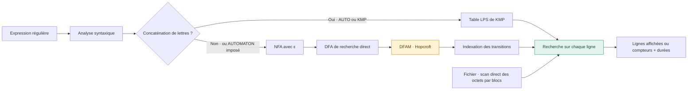
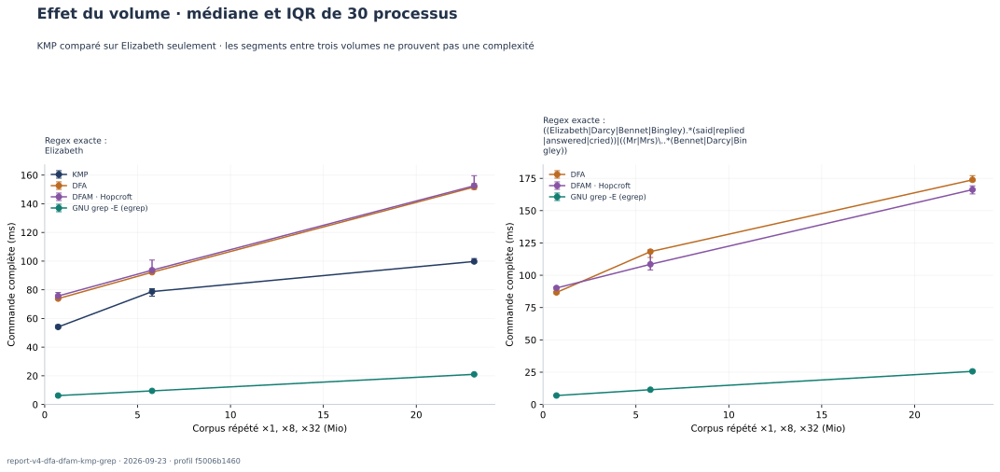

<div align="center">

# REGEX SEARCH

### De l’expression régulière à la recherche dans un fichier

**Projet algorithmique DAAR · Sorbonne · 2026**

[Prise en main](#prise-en-main) · [Documentation technique](#rapport) · [Résultats expérimentaux](docs/05-experiences.md) · [Sujet](src/main/java/com/sorbonne/specifications/daar_projet1.pdf)

</div>

---

Une commande comme `grep -E 'Elizabeth|Darcy' roman.txt` tient sur une ligne. Derrière cette ligne, il faut pourtant répondre à plusieurs questions : comment représenter le motif ? Comment reconnaître une occurrence au milieu du texte ? Que faut-il préparer une seule fois, et que faut-il recommencer à chaque ligne ? À quel moment le coût de préparation devient-il plus important que la recherche elle-même ?

Ce projet reprend ces questions en construisant un moteur de recherche textuelle en Java. Le point de départ est une expression régulière ASCII et un fichier parcouru comme une suite brute d’octets. Le résultat recherché est l’ensemble des lignes contenant une occurrence du motif. Le projet propose un mode de recherche qui affiche ces lignes avec leur numéro, ainsi qu’un mode benchmark qui les compte sans les afficher.

Deux chemins sont disponibles. Un motif littéral, comme `Elizabeth`, est recherché par **Knuth–Morris–Pratt**. Un motif qui utilise une alternative, une étoile ou un point universel passe par un **arbre syntaxique**, un **automate non déterministe avec transitions ε**, puis un **automate déterministe**. La préparation transforme ensuite cet automate de reconnaissance en un moteur capable de trouver une occurrence à n’importe quelle position d’une ligne.

L’intérêt du travail tient autant aux résultats qu’aux distinctions à faire pour les obtenir. Reconnaître un mot entier ne suffit pas à trouver ce mot dans une phrase. Une recherche linéaire peut nécessiter une préparation coûteuse. Un benchmark Java mesuré après le démarrage de la JVM ne se compare pas directement au temps complet d’une commande `grep`. Ces points guident l’implémentation, les tests et le protocole expérimental présenté dans ce dépôt.

> **État de cette version.** La lecture des fichiers, KMP, les constructions NFA/DFA, la minimisation de Hopcroft, la recherche préparée et l’affichage des lignes correspondantes fonctionnent. La campagne expérimentale distingue explicitement déterminisation, minimisation, indexation et parcours du corpus.

<a id="rapport"></a>

## Parcours de lecture

| Partie                                                                  | Ce qu’on y trouve                                                                                   |
| :---------------------------------------------------------------------- | :-------------------------------------------------------------------------------------------------- |
| **01 — [Installer et utiliser](docs/01-utilisation.md)**                | Prérequis, scripts, exemples, binaire JAR et résolution des erreurs courantes                       |
| **02 — [Définir le problème et l’architecture](docs/02-conception.md)** | Contrat de recherche, syntaxe supportée, structures de données et partage des responsabilités       |
| **03 — [Comprendre les algorithmes](docs/03-algorithmes.md)**           | Construction des automates, fermetures ε, point universel, recherche de facteur, KMP et complexités |
| **04 — [Vérifier les résultats](docs/04-validation.md)**                | Tests simples, cas limites, génération reproductible, oracles et limites de la couverture           |
| **05 — [Mesurer et discuter](docs/05-experiences.md)**                  | Protocole, campagne réelle, graphiques, données brutes et limites des conclusions                   |
| **06 — [Terminer et préparer le rendu](docs/06-perspectives.md)**       | Travail restant, évolutions possibles et plan de synthèse conforme au sujet                         |
| **Références — [Sources et bibliographie](docs/references.md)**         | Sujet, chapitre fourni et documentation technique utilisée                                          |

Le README permet de démarrer sans lire tout le rapport. Les chapitres servent ensuite à suivre une décision jusqu’au code ou à vérifier un résultat jusqu’au CSV qui l’a produit.

<a id="prise-en-main"></a>

## 01 · Prérequis et première exécution

| Outil            | Version / usage                                                                                 |
| :--------------- | :---------------------------------------------------------------------------------------------- |
| **JDK**          | Java **21 ou supérieur**, avec `java` et `javac` ; version cible définie dans `pom.xml`         |
| **Maven**        | **3.6.3 ou supérieur** pour compiler, résoudre les dépendances et exécuter JUnit                |
| **Bash**         | Point d’entrée des scripts ; utilisable sous Linux, macOS ou un environnement Linux tel que WSL |
| **Python**       | **3.9 ou supérieur**, bibliothèque standard pour les comparaisons et leurs tests                |
| **GNU grep**     | Nécessaire uniquement pour la comparaison ; `ggrep` est recherché en priorité sur macOS         |
| **Locale `C`** | Imposée par le protocole pour comparer le même alphabet d’octets avec GNU grep                 |

JUnit **6.1.3** est une dépendance de test téléchargée par Maven. Le moteur Java n’appelle ni `grep` ni `java.util.regex` pour effectuer ses recherches. Matplotlib sert uniquement à régénérer les figures du rapport ; il n’est requis ni pour lancer le moteur ni pour exécuter les tests ordinaires.

Depuis la racine du projet :

```bash
# 1. Nettoyer, compiler et lancer les tests Java et Python.
./run.sh

# 2. Chercher une regex dans un fichier et afficher le détail des durées Java.
./scripts/benchmark.sh Samples/PrideAndPrejudice.txt 'Elizabeth|Darcy' AUTO

# Afficher les lignes correspondantes avec leur numéro.
./scripts/search.sh Samples/PrideAndPrejudice.txt 'Elizabeth|Darcy'

# 3. Comparer les commandes complètes Java et GNU grep -E.
./scripts/compare-egrep.sh Samples/PrideAndPrejudice.txt \
  'Elizabeth|Darcy' --runs 20 --warmups 3
```

Le fichier fourni donne **1 050 lignes correspondantes sur 14 915** pour `Elizabeth|Darcy`. Ce résultat concerne la copie du livre présente dans le dépôt, en incluant son en-tête et sa notice Gutenberg. Une autre édition peut produire un autre compte. Le mode `search.sh` affiche ces lignes au format `numéro:contenu`, comme `egrep -n`.

Pour comparer KMP et les automates sur **le même motif** :

```bash
./scripts/benchmark.sh Samples/PrideAndPrejudice.txt 'Elizabeth' KMP
./scripts/benchmark.sh Samples/PrideAndPrejudice.txt 'Elizabeth' DFA
./scripts/benchmark.sh Samples/PrideAndPrejudice.txt 'Elizabeth' DFAM
./scripts/benchmark.sh Samples/PrideAndPrejudice.txt 'Elizabeth' MOORE
```

Les deux chemins trouvent **644 lignes**. Les temps affichés par ces deux appels isolés servent à examiner les étapes, pas à établir une comparaison statistique. Le chapitre expérimental utilise plusieurs répétitions.


Le JAR expose également une interface directe :

```bash
java -jar regex-search.jar --help
java -jar regex-search.jar --count Samples/PrideAndPrejudice.txt 'Elizabeth|Darcy' AUTO
java -jar regex-search.jar --print Samples/PrideAndPrejudice.txt 'Elizabeth|Darcy' AUTOMATON
```

Les erreurs d’usage, de motif ou de fichier sont affichées sans stack trace avec le code de sortie `2`; une exécution valide retourne `0`.

`run.sh` reste le seul script à la racine. Les autres commandes sont dans [`scripts/`](scripts/README.md). Les chemins fournis sont relatifs au répertoire depuis lequel la commande est lancée ; les scripts retrouvent eux-mêmes la racine du projet.

> Les résultats enregistrés par défaut dans `target/benchmarks/` sont effacés au prochain `./run.sh`, car celui-ci exécute `mvn clean`. Utiliser `--output-dir` pour conserver une campagne ailleurs. Les assets publiés dans `docs/assets/` sont conservés.

## 02 · Une préparation, plusieurs milliers de lignes



La préparation du motif se fait **avant** la boucle de lecture. Le parseur et le constructeur NFA sont linéaires et itératifs. Le comptage traite des blocs de 64 Kio avec un curseur réinitialisé entre les lignes : même une très longue ligne ne doit pas tenir en mémoire. Le mode d’affichage conserve une ligne entière pour pouvoir la restituer. Les motifs acceptant le mot vide correspondent à toutes les lignes et évitent la construction des automates.

Le choix de KMP repose sur l’arbre syntaxique. Par exemple, `a.b` contient un point universel et utilise les automates, tandis que `a\.b` représente trois caractères littéraux et peut utiliser KMP. Tester simplement si la chaîne contient un point conduirait à un mauvais choix.

[Modifications et complexités des optimisations](docs/07-optimisations.md).

## 03 · Protocole expérimental reproductible

Le profil versionné [`report-v5-byte-alphabet`](scripts/report-profile.json) compare **DFA sans minimisation, DFAM avec Hopcroft, KMP et GNU grep -E (egrep)**. Il fixe **32 cas Java**, dont 30 comparés en ligne de commande : mêmes regex, corpus, options Java 21 et répétitions. KMP participe seulement sur les littéraux `Elizabeth` et `ababababac` ; il n'est pas applicable aux opérateurs regex. `AUTOMATON` reste un alias du chemin avec minimisation pour les anciens appels.

Chaque cas CLI utilise **30 processus par moteur**, avec ordre équilibré. Les étapes Java sont aussi mesurées dans **5 JVM indépendantes**, chacune avec 10 prépassages puis 10 mesures. Le [rapport des résultats](docs/assets/benchmark.md) présente les quatre moteurs côte à côte, les coûts préparation/parcours et la taille des automates avant/après Hopcroft. La série grep affichée vient du cas DFA associé ; les répétitions grep des autres cas restent dans les CSV.

```bash
# Campagne de référence : exige un arbre Git propre.
./scripts/report-campaign.sh

# Même campagne, puis suppression des CSV/TXT locaux après publication.
./scripts/report-campaign.sh --purge

# Essai de développement : autorise Git sale mais ne remplace pas docs/assets/.
./scripts/report-campaign.sh --allow-dirty

# Nettoyer toutes les sorties locales de benchmark sans toucher aux assets publiés.
./scripts/clean-report.sh
```

Pour publier explicitement une campagne locale validée avant les commits : `./scripts/freeze-report.sh`. Le manifeste garde honnêtement `git_dirty=true` et les empreintes exactes des sources mesurées ; créer les commits ne modifie pas ces empreintes.

Une campagne réussie suit toujours le même ordre : **préflight → tests → corpus dérivés → validation exacte contre GNU grep → profil structurel → mesures CLI → mesures JVM → agrégation → figures → publication atomique → nettoyage**. `docs/assets/` n'est remplacé qu'après toutes les vérifications ; une erreur laisse l'ancienne référence intacte. Les corpus dérivés sont supprimés après succès ; les figures locales restent disponibles pour un essai `--allow-dirty`. Sans `--purge`, les CSV/TXT restent sous `target/report/results/` pour audit ; avec `--purge`, ils sont supprimés seulement après publication des SVG, `benchmark.md` et `benchmark.json`.




Les motifs nullables comme `(a|b)*` utilisent le raccourci commun sans automate ; ils ne mesurent donc pas Hopcroft.

Le graphique `compilation.svg` utilise la famille de croissance contrôlée : profondeur 5, 7 puis 9. Elle construit environ 66, 258 puis 1 026 états dans le DFA de recherche avant minimisation ; cette série est donc plus informative qu'une simple augmentation de la longueur d'un mot littéral. La campagne publie désormais aussi le nombre d'états/transitions après `DFAM` et le coût propre de la minimisation.

Pour produire le rendu final, le packaging part uniquement des fichiers suivis par Git et du JAR compilé :

```bash
./scripts/package.sh
# -> dist/regex-search.jar
# -> dist/regex-search-submission.zip (refusé automatiquement au-delà de 10 Mio)
```

Le packaging exige un arbre Git propre et exclut mécaniquement `.git`, `target`, caches, environnements Python et fichiers IDE.

## 04 · Lire le dépôt

```text
regex-search/
├── README.md                         # entrée du projet et plan du rapport
├── run.sh                            # nettoyage, compilation et tests
├── pom.xml                           # Java, JUnit et plugins Maven
├── Samples/                          # fichiers texte utilisés pour les essais
├── scripts/                          # benchmark, comparaison et campagne du rapport
├── docs/
│   ├── 01-utilisation.md …            # chapitres détaillés
│   └── assets/                       # six SVG publiés, rapport et manifeste reproductibles
└── src/
    ├── main/java/com/sorbonne/
    │   ├── automata/                 # états, transitions et graphes
    │   ├── regex/                    # parseur, arbres, NFA, DFA et DFAM
    │   ├── search/                   # KMP et recherche par automate
    │   ├── benchmark/                # préparation, parcours et chronométrage
    │   ├── utils/                    # scan direct byte[] sur alphabet 0..255
    │   └── specifications/           # sujet et chapitre de référence
    └── test/java/com/sorbonne/       # exemples, propriétés et générateurs
```

Les tests ne sont pas seulement des exemples heureux. Ils couvrent aussi les correspondances qui se chevauchent, les cycles ε, les transitions ambiguës, les caractères échappés, les lignes vides et les erreurs d’entrée-sortie. Les cas générés utilisent des graines fixes ; leur fonctionnement et leurs limites sont expliqués dans le [chapitre de validation](docs/04-validation.md).

## 05 · État du rendu

La chaîne algorithmique est complète jusqu’à la minimisation de Hopcroft et les tests de préservation du langage. Le mode d’affichage des lignes est disponible via `scripts/search.sh`; le rapport LaTeX et le packaging final sont produits à partir de la campagne reproductible.

Le dossier `docs/` est volontairement plus développé qu’un rapport de remise. Le [sujet](src/main/java/com/sorbonne/specifications/daar_projet1.pdf) conseille 5 à 10 pages et impose une limite de 12 pages : le [plan de synthèse](docs/06-perspectives.md#rendu) indique quoi conserver dans ce format. La documentation étendue et les données expérimentales peuvent accompagner le rendu sans être confondues avec ce document limité en pages.
