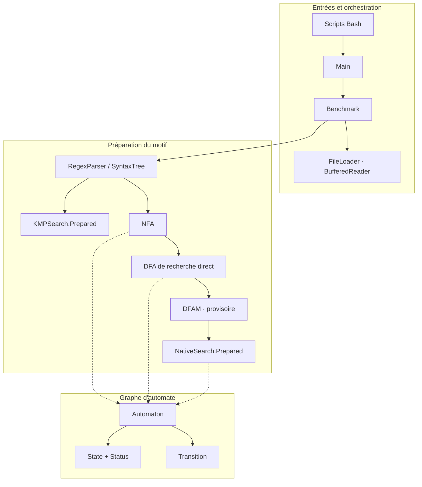

[← Utilisation](01-utilisation.md) · [Accueil](../README.md) · [Algorithmes →](03-algorithmes.md)

# 02 — Du besoin au contrat de recherche

## 1. Le problème posé

Le sujet décompose la recherche dans un fichier en recherches indépendantes sur chacune de ses lignes. Cette décomposition a une conséquence pratique : le motif reste le même, mais l’état de lecture doit repartir de zéro à chaque ligne. Elle suggère aussi de préparer le motif une seule fois, puis de partager cette préparation sur tout le fichier.

Notons $L(r)$ le langage décrit par l’expression $r$. Une ligne $t$ correspond au motif s’il existe deux positions $i$ et $j$ telles que :

$$
0 \le i \le j \le |t| \quad\text{et}\quad t[i:j] \in L(r).
$$

Le cas $i=j$ autorise une occurrence vide. Ainsi, `a*` correspond à toute ligne, même à une ligne qui ne contient aucun `a`. Il ne crée toutefois pas de ligne dans un fichier vide : ce fichier contient zéro ligne à examiner.

Le benchmark retourne :

$$
\mathrm{matchingLines}(F,r)=\sum_{t\in\mathrm{lignes}(F)}\mathbf{1}[t\text{ contient une occurrence de }r].
$$

Il ne retourne ni le nombre total d’occurrences ni leurs positions. Une ligne contenant trois fois `Elizabeth` compte **une** fois.

### Reconnaître, chercher et parcourir un fichier

| Opération | Exemple pour le motif `ab` | Usage dans le projet |
| :--- | :--- | :--- |
| Reconnaître un mot entier | `ab` est accepté, `xxab` ne l’est pas | Langage du NFA et du DFA construits à partir de la regex |
| Chercher un facteur | `xxabyy` contient une occurrence | `KMPSearch` et `NativeSearch` |
| Chercher dans un fichier | Appliquer cette recherche à chaque ligne | `Benchmark` et `FileLoader` |

Un automate correct pour la première opération n’est donc pas, à lui seul, un moteur complet pour la deuxième. La préparation de `NativeSearch` traite précisément cette différence.

## 2. Le périmètre des expressions

Le [sujet](../src/main/java/com/sorbonne/specifications/daar_projet1.pdf) retient un sous-ensemble des ERE : lettres ASCII, concaténation, alternative, étoile, parenthèses et point universel. L’implémentation Java manipule plus généralement des unités UTF-16 ; cela ne signifie pas qu’elle implémente toute la norme ERE ni une sémantique Unicode par point de code.

| Construction | Exemple | Sens |
| :--- | :--- | :--- |
| Lettre | `a` | Le caractère `a` |
| Concaténation | `ab` | `a` immédiatement suivi de `b` |
| Alternative | $a\mid b$ | Union de deux langages |
| Étoile | `ab*` | `a` suivi de zéro ou plusieurs `b` |
| Groupe | `a(bc)*` | Répétition du groupe `bc` après `a` |
| Point universel | `a.b` | Un caractère quelconque entre `a` et `b` |
| Échappement | `a\.b` | Le texte littéral `a.b` |

La priorité est : **parenthèses, étoile, concaténation, alternative**. `ab*|c` se lit donc `(a(b*))|c`.

Dans une commande Bash, l’alternative s’écrit `'a|b'`, entre guillemets simples pour que le shell ne l’interprète pas comme un tube.

### Ce que le parseur n’implémente pas

`+`, `?`, les classes `[abc]`, les intervalles `{m,n}`, les ancres `^` et `$`, les références arrière et les classes abrégées telles que `\d` ne font pas partie des opérateurs implémentés. Certains de ces caractères sont actuellement lus comme des lettres par le parseur, plutôt que rejetés. Il faut donc éviter de conclure qu’une expression est compatible avec grep simplement parce qu’elle a été acceptée par Java.

Le comparateur possède un contrôle plus strict du sous-ensemble commun et refuse ces constructions. Il rejette également les échappements ambigus et les étoiles répétées. Le parseur Java conserve pour sa part une barre oblique inverse finale comme un caractère littéral ; le comparateur la refuse.

L’expression vide est rejetée par `RegexParser`. C’est distinct du motif littéral vide accepté par l’API KMP et d’une expression non vide comme `a*`, dont le langage contient le mot vide.

## 3. L’architecture et ses frontières



Le [modèle d’automate](../src/main/java/com/sorbonne/automata/) ne lit pas les fichiers. Le [parseur](../src/main/java/com/sorbonne/regex/RegexParser.java) ne décide pas du chronométrage. Les [moteurs de recherche](../src/main/java/com/sorbonne/search/) reçoivent des chaînes et ignorent leur provenance. Cette séparation permet de tester un graphe avec un texte très court sans fabriquer un fichier, puis de tester les entrées-sorties indépendamment des détails de construction de l’automate.

`Benchmark` prépare le moteur, ouvre le fichier, compte les lignes et renvoie un `Result`. `Main` s’occupe de l’affichage. Aucun affichage de ligne ni de graphe ne se produit à l’intérieur de la boucle chronométrée.

## 4. Les structures de données

### Automaton

Les états sont stockés dans un `LinkedHashSet<State>`, les transitions dans une `ArrayList<Transition>`. Un index des arcs par source est maintenu lors des ajouts ; les listes exposées restent des instantanés non modifiables. L’ordre d’insertion rend les représentations lisibles et relativement stables ; il ne définit pas l’état initial. Les rôles initiaux et finaux dépendent du `Status` porté par chaque état.

Les collections exposées ne permettent pas d’ajouter ou de retirer directement des éléments. Cela ne rend pas tout le graphe immuable : un `State` reste modifiable, et plusieurs graphes peuvent référencer le même objet.

Deux états ayant le même nom sont deux états distincts. `State` conserve l’égalité par identité d’objet ; son UUID ne redéfinit pas `equals` ou `hashCode`. Cette propriété est utile lors de la composition de sous-automates : une étiquette identique ne fusionne pas accidentellement deux sommets.

### Transition

Trois types sont distingués :

- `CHARACTER` consomme un `char` précis ;
- `EPSILON` ne consomme aucun caractère ;
- `ANY` consomme un `char`, sauf les caractères éventuellement exclus.

Le point littéral et le point universel n’ont pas la même représentation. Les exclusions d’un arc `ANY` servent à construire des classes de caractères disjointes dans le DFA. Elles ne constituent pas une implémentation de la syntaxe ERE des classes `[ ... ]`.

### SearchAlgorithm et Prepared

```java
SearchAlgorithm<String> literalSearch = new KMPSearch();
SearchAlgorithm<Automaton> automatonSearch = new NativeSearch();
```

Le contrat est générique parce que les deux moteurs n’attendent pas le même motif. Une `String` n’a pas le même rôle qu’un DFA déjà construit. Le type empêche de passer l’un à la place de l’autre, sans forcer des conversions internes opaques.

Pour traiter plusieurs lignes, les méthodes `prepare` rendent ce coût explicite :

```java
KMPSearch.Prepared search = KMPSearch.prepare("Elizabeth");
boolean first = search.search("Elizabeth enters the room.");
boolean second = search.search("Darcy remains silent.");
```

La table LPS de KMP n’est pas reconstruite entre ces deux appels. `NativeSearch.Prepared` conserve des tables privées d’entiers indépendantes des mutations du graphe. Les deux moteurs implémentent `PreparedSearch` ; `newCursor()` crée un état de recherche en flux indépendant, réinitialisable à chaque nouvelle ligne.

## 5. Entrées-sorties et mémoire

`FileLoader.open` ouvre un fichier ordinaire avec un décodeur UTF-8 strict et un `BufferedReader` de **65 536 caractères**. Un encodage invalide déclenche une erreur ; il n’est pas remplacé silencieusement par un caractère de substitution qui pourrait changer le résultat de la recherche.

Le tampon réduit le nombre de petits accès au lecteur sous-jacent. Sa taille est un compromis de mise en œuvre, **pas une valeur démontrée optimale** : aucune campagne ne compare ici plusieurs tailles de tampon.

Le comptage utilise `FileLoader.count` : lecture par blocs et conservation du seul état du moteur, sans allocation d’une chaîne par ligne. Sa mémoire de parcours dépend du tampon, même pour une ligne de plusieurs centaines de mégaoctets. Le mode d’affichage utilise encore `readLine()` pour restituer la ligne complète.

Les séparateurs LF, CRLF et CR sont reconnus, même lorsqu’un CRLF traverse deux blocs. Une dernière ligne sans séparateur final est traitée. Une fin de fichier immédiatement après un LF ne crée pas de ligne vide supplémentaire.

## 6. Ce que le résultat permet de vérifier

`Result` associe le fichier, le motif, la stratégie réellement choisie, les deux compteurs et les durées. `Timings` distingue l’analyse syntaxique, la construction NFA, la déterminisation, l’appel à DFAM et la préparation du moteur.

Le temps de parcours inclut **ouverture, lecture, décodage, recherche, comptage et fermeture**. Il ne s’agit pas d’un temps de recherche isolé. Les étapes non exécutées sur le chemin KMP ou pour un motif nullable valent zéro. Pour les autres motifs, `dfaNanos` mesure la construction du DFA de recherche et `searchPreparationNanos` son indexation, sans deuxième déterminisation. Le temps total est la somme de la préparation globale et du parcours, mesurés à partir de frontières communes.

En cas d’erreur, le pipeline ne rend pas un compte partiel présenté comme un succès. La fermeture du lecteur est assurée par `try-with-resources`.

[← Utilisation](01-utilisation.md) · [Accueil](../README.md) · [Algorithmes →](03-algorithmes.md)
