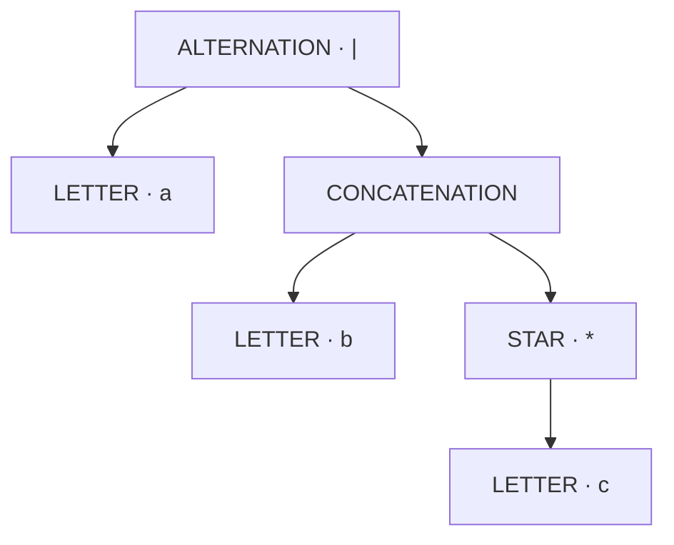
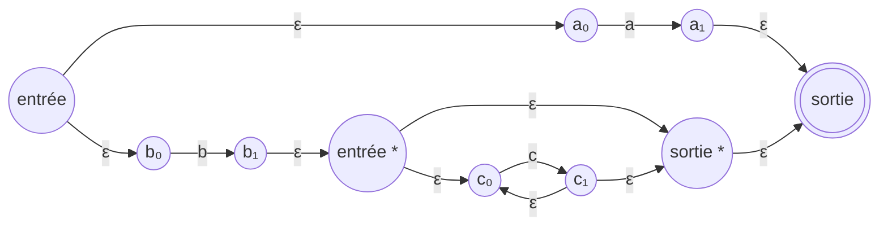
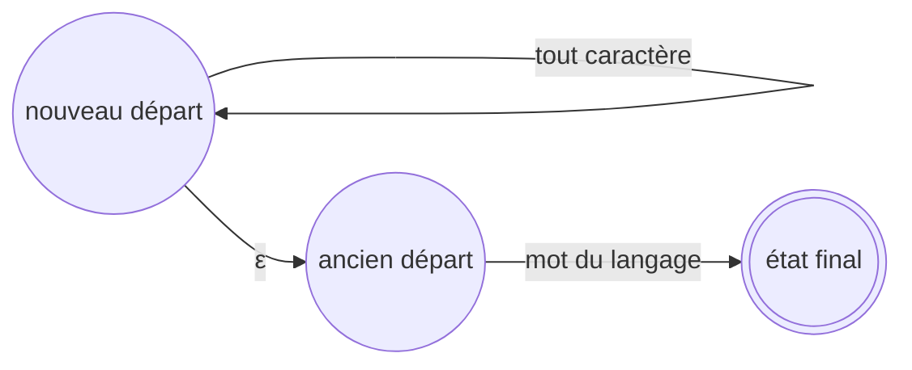

[← Conception](02-conception.md) · [Accueil](../README.md) · [Validation →](04-validation.md)

# 03 — Algorithmes, invariants et coûts

L’analyse qui suit sépare trois choses : le problème mathématique, la construction choisie et les coûts du code présent dans le dépôt. Une borne connue pour un algorithme ne se transfère pas automatiquement à une implémentation qui recopie ses structures à chaque étape.

## 1. Notations

| Symbole | Signification |
| :--- | :--- |
| $m$ | Longueur de l’expression, ou du motif littéral selon la section |
| $n$ | Longueur d’une ligne en unités UTF-16 |
| $C$, $L$ | Nombre total d’unités UTF-16 du contenu des lignes, et nombre de lignes |
| $N$, $E$ | Nombre d’états et d’arcs du NFA à déterminer |
| $X$ | Nombre d’exclusions de caractères stockées dans ce graphe |
| $K$ | Nombre de classes de caractères considérées par la déterminisation |
| $R$ | Nombre de sous-ensembles accessibles effectivement construits |
| $B$, $M$ | Taille du tampon de lecture et longueur de la plus grande ligne |

Les coûts « moyens » ci-dessous supposent des accès moyens constants aux tables de hachage. La taille d’un ensemble d’états intervient dans son calcul de hash : utiliser cet ensemble comme clé n’est pas une opération gratuite.

## 2. Construire l’arbre syntaxique

Le [parseur](../src/main/java/com/sorbonne/regex/RegexParser.java) commence par distinguer les lettres des opérateurs. Il réduit ensuite les groupes entre parenthèses, les étoiles, les concaténations et les alternatives, dans cet ordre.

Pour `a|bc*`, la structure est :



L’arbre garde le rôle des caractères. La feuille issue de `\.` représente un point littéral ; un point non échappé devient un nœud `DOT`. C’est cette distinction qui permet au benchmark de sélectionner le bon moteur.

**Coût du code actuel.** La tokenisation est linéaire en $m$. La réduction ne l’est pas nécessairement : les méthodes parcourent des listes pour réduire un opérateur à la fois. Sur une longue concaténation plate, la somme des parcours est de l’ordre de $m+(m-1)+\cdots+1$, soit $\Theta(m^2)$. Le traitement des parenthèses utilise également des insertions en tête d’`ArrayList` et des passages récursifs. Nous ne revendiquons donc pas un parseur globalement linéaire.

L’arbre final contient $O(m)$ nœuds. Sa profondeur peut aussi atteindre $O(m)$, ce qui rend les parcours récursifs sensibles à des expressions très longues. Un parseur à pile, avec gestion explicite des priorités, serait une piste pour obtenir une analyse plus prévisible ; ce n’est pas l’implémentation mesurée ici.

## 3. Passer de l’arbre à un NFA avec ε

La construction de [NFA](../src/main/java/com/sorbonne/regex/NFA.java) suit la décomposition structurelle présentée dans le chapitre fourni, section 10.8. Chaque sous-expression produit un fragment avec une entrée et une sortie. Les fragments sont reliés sans énumérer les mots du langage, qui peuvent être en nombre infini.

| Nœud de l’arbre | Construction |
| :--- | :--- |
| Lettre / point | Deux états reliés par une transition qui consomme un caractère |
| Concaténation $rs$ | Relier la sortie du fragment $r$ à l’entrée du fragment $s$ par ε |
| Alternative $r\mid s$ | Ajouter une entrée qui rejoint les deux branches et une sortie commune |
| Étoile $r^*$ | Ajouter un passage direct pour le mot vide, une entrée dans $r$, une boucle et une sortie |

Un graphe illustratif pour `a|bc*` est le suivant. Les noms servent à suivre les chemins, pas à imposer la numérotation du constructeur.



### Pourquoi cette construction reconnaît le bon langage

La justification se fait par induction sur l’arbre. Une feuille reconnaît exactement son caractère. Une concaténation doit traverser successivement les deux fragments. Une alternative choisit l’une des branches. L’étoile peut éviter le fragment, le parcourir une fois ou reprendre sa boucle autant de fois que nécessaire. Les transitions ε assurent ces compositions sans ajouter de caractère au mot reconnu.

Le constructeur modifie les anciens statuts d’entrée et de sortie au moment d’assembler les fragments. Cela explique pourquoi le graphe de base autorise des états mutables. Ces fragments sont internes à la construction ; il ne faut pas les interpréter comme des graphes immuables partagés librement avec d’autres traitements.

### Taille linéaire, temps de construction à distinguer

Le nombre final d’états et d’arcs est $O(m)$ : chaque opérateur ajoute un nombre constant d’éléments. Une construction par fragments reliés dans un même graphe peut réaliser ce travail en temps linéaire.

Dans le code actuel, `mergeInto` réinsère les états et transitions des sous-automates dans un nouveau conteneur. Sur un arbre déséquilibré, un même préfixe est recopié plusieurs fois. Le travail cumulé peut donc atteindre $O(m^2)$ en moyenne pour les accès aux ensembles. Les recherches des états initiaux et finaux ajoutent elles aussi des parcours de sous-graphes.

La borne linéaire sur la **taille finale** reste vraie. Elle ne suffit pas à décrire le volume d’allocations et de copies effectué pendant la construction. C’est une optimisation possible avant de tirer des conclusions générales sur le coût de compilation des regex.

## 4. Déterminiser par les sous-ensembles

Un NFA peut être dans plusieurs états après avoir lu le même préfixe. L’idée de la [déterminisation](../src/main/java/com/sorbonne/regex/DFA.java) consiste à représenter cet ensemble par un état unique du DFA.

Pour un ensemble $S$, sa fermeture ε, notée $\varepsilon\text{-fermeture}(S)$, rassemble les états atteignables sans lire de caractère. Le départ du DFA est :

$$
S_0=\varepsilon\text{-fermeture}(\{q_0\}).
$$

Après lecture de $c$ :

$$
\delta_D(S,c)=\varepsilon\text{-fermeture}\left(\bigcup_{q\in S}\delta_N(q,c)\right).
$$

L’ensemble obtenu est final s’il contient au moins un état final du NFA. Une file traite les ensembles accessibles ; une table associe chaque ensemble immuable à son état DFA. Les cycles ε terminent parce que la fermeture mémorise les états déjà visités.

**Invariant.** Après lecture d’un préfixe $u$, l’état courant du DFA représente exactement tous les états dans lesquels le NFA pourrait se trouver après $u$, transitions ε comprises. Le critère d’acceptation découle directement de cet invariant.

Le résultat est un **DFA partiel**. Quand aucun état n’est atteignable, aucun arc n’est ajouté. L’absence d’arc représente le rejet ; un état puits explicite n’est pas obligatoire pour cette utilisation.

### Le point universel : un piège de déterminisation

Supposons que deux branches proposent un arc sur `a` et un arc universel. À la lecture de `a`, **les deux destinations doivent contribuer** au sous-ensemble suivant. Donner arbitrairement priorité à la lettre ferait perdre une partie du langage.

Le code découpe donc l’alphabet en classes disjointes : un singleton par caractère explicite, puis la classe des autres caractères. Les exclusions déjà présentes sur les arcs `ANY` participent aussi à ce découpage.

| Classe | Arcs du NFA à prendre en compte |
| :--- | :--- |
| `a` | Tous les arcs littéraux `a` et les arcs `ANY` qui acceptent `a` |
| Autres caractères | Les arcs `ANY` qui acceptent le représentant de cette classe |

Dans le DFA, la seconde classe est stockée par `anyExcept`, sans créer 65 536 transitions pour les 65 536 valeurs possibles d’un `char` Java. Cette partition rend les décisions disjointes ; ce n’est pas un ordre de priorité entre deux arcs concurrents.

### Coût

L’index des arcs sortants coûte $O(N+E+X)$. Chaque paire « sous-ensemble, classe » peut parcourir au plus les états et arcs de l’entrée pour effectuer le déplacement et la fermeture. La borne utilisée est donc :

$$
T_D=O\bigl(N+E+X+RK(N+E)\bigr),\qquad R\le 2^N.
$$

La mémoire supplémentaire est de l’ordre de :

$$
O\bigl(N+E+X+R(N+K)\bigr).
$$

Elle comprend les index, les ensembles mémorisés et le graphe produit. L’alphabet `char` est borné ; la recherche d’un représentant de la classe complémentaire est donc elle aussi bornée par sa taille. L’explosion du nombre de sous-ensembles reste la difficulté principale : indexer les arcs évite des parcours inutiles, mais ne supprime pas cette croissance possible.

## 5. La minimisation : une étape prévue, pas un résultat acquis

[DFAM](../src/main/java/com/sorbonne/regex/DFAM.java) expose pour l’instant :

```java
public static Automaton minimize(Automaton dfa)
```

La méthode contrôle seulement la non-nullité et retourne le même objet. Son coût actuel est $O(1)$ en temps et en mémoire supplémentaire. Il serait trompeur d’attribuer ce coût à une véritable minimisation.

Le contrat de la future version devra préserver le langage, traiter correctement les transitions absentes et respecter les classes de caractères. Un DFA partiel demande notamment de décider comment représenter le rejet lors du raffinement des classes d’états. Le chapitre des [perspectives](06-perspectives.md) décrit les validations attendues.

## 6. Trouver une occurrence avec NativeSearch

Le DFA précédent reconnaît un **mot entier**. Pour chercher ce mot partout dans une ligne, il ne suffit pas de revenir à son état initial après chaque échec. Exemple : chercher `ab` dans `aab`. Après avoir consommé le premier `a`, un échec sur le second `a` peut faire oublier que ce second caractère est lui-même le début d’une occurrence.

La [préparation](../src/main/java/com/sorbonne/search/NativeSearch.java) traite tous les départs possibles simultanément. Elle copie le DFA, ajoute un nouveau départ avec une boucle universelle et le relie à l’ancien départ par ε. Puis elle détermine ce graphe augmenté.



Le graphe augmenté reconnaît $\Sigma^*L(r)$. Pendant la lecture, le moteur s’arrête dès qu’un **préfixe** de la ligne est accepté. Ce préfixe se décompose alors en un contexte quelconque suivi d’un mot de $L(r)$ : une occurrence vient d’être trouvée. Le suffixe de la ligne n’a pas besoin d’être parcouru par le moteur, même si le lecteur a déjà construit la ligne entière.

Le nouvel état initial est testé avant tout caractère. Si le motif accepte ε, la recherche réussit immédiatement, y compris sur une ligne vide.

### Une seconde déterminisation, à compter dans la préparation

Cette stratégie paie la gestion des départs possibles avant le parcours du texte. Elle implique une **nouvelle déterminisation**, qui peut être exponentielle en la taille du DFA fourni. Minimiser le DFA du motif pourra réduire cette entrée, mais ne prouvera pas que le DFA de recherche finalement obtenu est minimal.

Le moteur préparé stocke des index par état et par caractère, ainsi qu’un éventuel arc complémentaire. Pour une ligne de longueur $n$, le parcours est $O(n)$ en moyenne et utilise $O(1)$ de mémoire supplémentaire, en dehors de l’index déjà construit. La préparation et la taille de cet index doivent être comptées séparément.

`NativeSearch` ne désigne pas le moteur regex natif de Java. C’est le moteur du projet, qui ne délègue ni à `String.contains` ni à `Pattern`.

## 7. KMP pour les motifs littéraux

KMP évite de reconsidérer inutilement les caractères du texte après un échec partiel. Il prépare une table LPS, pour *Longest Proper Prefix which is also Suffix*. À chaque position du motif, la table donne la longueur du plus long préfixe propre qui est aussi un suffixe de la portion déjà reconnue.

Pour `ababac` :

| Position | 0 | 1 | 2 | 3 | 4 | 5 |
| :--- | ---: | ---: | ---: | ---: | ---: | ---: |
| Caractère | a | b | a | b | a | c |
| LPS | 0 | 0 | 1 | 2 | 3 | 0 |

Si `ababa` a été reconnu et que le caractère suivant ne permet pas de lire `c`, le suffixe `aba` reste un préfixe candidat. Le moteur ajuste l’indice du motif au lieu de faire reculer celui du texte.

**Invariant.** Après traitement d’un préfixe du texte, l’indice $j$ représente la longueur du préfixe du motif reconnu à la fin de ce texte traité. Un repli vers `lps[j-1]` conserve un suffixe compatible ; les candidats éliminés ne peuvent pas former une occurrence.

La construction LPS est $O(m)$ en temps et en mémoire. La recherche est $O(n)$ : l’indice du texte ne recule jamais, et le nombre total de replis du motif est amorti par ses avancées. Le moteur préparé ajoute seulement deux indices locaux pendant le parcours.

Sur un fichier entier, avec une préparation unique :

$$
T_{KMP}=O(m+C+L),\qquad M_{KMP}=O(m+B+M).
$$

Cette formule décrit le moteur et le parcours. Le benchmark actuel analyse d’abord l’expression pour décider si elle est littérale : **le coût du parseur s’ajoute**. Le temps complet de `Benchmark` sur une longue expression littérale n’est donc pas garanti par la seule borne linéaire de KMP.

## 8. Bilan des coûts et portée des optimisations

| Étape | Temps / propriété du code actuel | Limite à garder en tête |
| :--- | :--- | :--- |
| Analyse syntaxique | Tokenisation linéaire ; réductions quadratiques sur une longue concaténation | Parcours de listes et profondeur récursive |
| NFA | Taille finale $O(m)$ ; assemblages pouvant coûter $O(m^2)$ | Recopie des sous-graphes |
| DFA | $O(N+E+X+RK(N+E))$ en moyenne | $R$ peut atteindre $2^N$ |
| DFAM | $O(1)$ actuellement | Identité provisoire, aucune minimisation |
| Préparation NativeSearch | Copie/indexation puis nouvelle déterminisation | Explosion possible pendant la préparation |
| Recherche NativeSearch préparée | $O(n)$ en moyenne | Coût et taille de l’index exclus de ce parcours |
| Préparation KMP | $O(m)$ | Motif littéral uniquement |
| Recherche KMP préparée | $O(n)$ | Préparation et parseur à ajouter au temps complet |
| Parcours bufferisé | $O(C+L)$ | Une ligne complète reste allouée |

Les décisions favorables au parcours sont concrètes : préparer une fois, indexer les arcs, ne pas afficher les lignes pendant les mesures et réutiliser les tables KMP. Elles ne justifient pas l’affirmation générale « le projet est optimal ». Le parseur, les copies de fragments, les états possibles et la gestion mémoire restent des coûts observables ou à mesurer.

[← Conception](02-conception.md) · [Accueil](../README.md) · [Validation →](04-validation.md)
