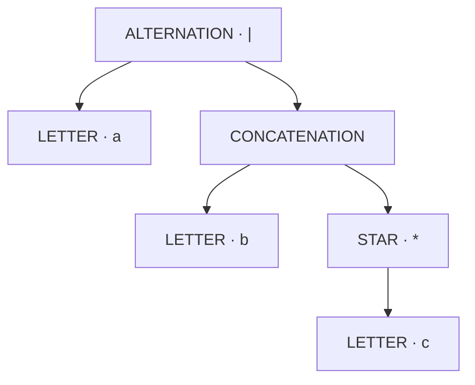
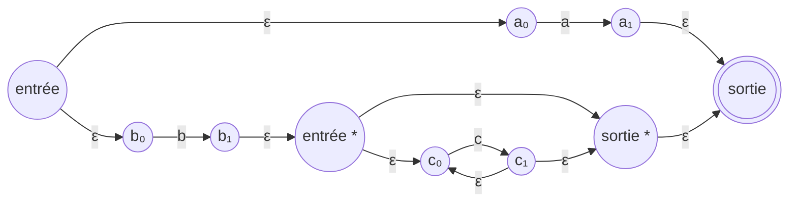

[← Conception](02-conception.md) · [Accueil](../README.md) · [Validation →](04-validation.md)

# 03 — Algorithmes, invariants et coûts

L’analyse qui suit sépare trois choses : le problème mathématique, la construction choisie et les coûts du code présent dans le dépôt. Une borne connue pour un algorithme ne se transfère pas automatiquement à une implémentation qui recopie ses structures à chaque étape.

## 1. Notations

| Symbole | Signification |
| :--- | :--- |
| $m$ | Longueur de l’expression, ou du motif littéral selon la section |
| $n$ | Longueur d’une ligne en octets |
| $C$, $L$ | Nombre total d’octets du contenu des lignes, et nombre de lignes |
| $N$, $E$ | Nombre d’états et d’arcs du NFA à déterminer |
| $X$ | Nombre d’exclusions de caractères stockées dans ce graphe |
| $K$ | Nombre de classes de caractères considérées par la déterminisation |
| $R$ | Nombre de sous-ensembles accessibles effectivement construits |
| $B$, $M$ | Taille du tampon de lecture et longueur de la plus grande ligne |

Les coûts « moyens » ci-dessous supposent des accès moyens constants aux tables de hachage. La taille d’un ensemble d’états intervient dans son calcul de hash : utiliser cet ensemble comme clé n’est pas une opération gratuite.

## 2. Construire l’arbre syntaxique

Le [parseur](../src/main/java/com/sorbonne/regex/RegexParser.java) distingue les lettres des opérateurs, puis utilise une pile d’opérandes et une pile d’opérateurs. Les priorités sont étoile, concaténation et alternative ; les parenthèses délimitent les réductions. Les opérateurs binaires sont associatifs à gauche.

Pour `a|bc*`, la structure est :

L’arbre garde le rôle des caractères. La feuille issue de `\.` représente un point littéral ; un point non échappé devient un nœud `DOT`. C’est cette distinction qui permet au benchmark de sélectionner le bon moteur.

**Coût du code actuel.** Chaque jeton est lu une fois, chaque opérateur est empilé et dépilé une fois : temps et mémoire $O(m)$, arbre compris. Les groupes ne produisent pas de nœuds de protection intermédiaires. Les échappements, y compris un antislash final littéral, sont conservés.

La profondeur de l’arbre peut atteindre $O(m)$, mais ni le parseur ni le constructeur NFA n’utilisent la récursion Java. Les tests couvrent 20 000 lettres concaténées et 20 000 niveaux de groupes ou d’étoiles sans seuil temporel dépendant de la machine.

## 3. Passer de l’arbre à un NFA avec ε

La construction de [NFA](../src/main/java/com/sorbonne/regex/NFA.java) suit la décomposition structurelle présentée dans le chapitre fourni, section 10.8. Chaque sous-expression produit un fragment avec une entrée et une sortie. Les fragments sont reliés sans énumérer les mots du langage, qui peuvent être en nombre infini.

| Nœud de l’arbre | Construction |
| :--- | :--- |
| Lettre / point | Deux états reliés par une transition qui consomme un caractère |
| Concaténation $rs$ | Relier la sortie du fragment $r$ à l’entrée du fragment $s$ par ε |
| Alternative $r\mid s$ | Ajouter une entrée qui rejoint les deux branches et une sortie commune |
| Étoile $r^*$ | Ajouter un passage direct pour le mot vide, une entrée dans $r$, une boucle et une sortie |

Un graphe illustratif pour `a|bc*` est le suivant. Les noms servent à suivre les chemins, pas à imposer la numérotation du constructeur.

### Pourquoi cette construction reconnaît le bon langage

La justification se fait par induction sur l’arbre. Une feuille reconnaît exactement son caractère. Une concaténation doit traverser successivement les deux fragments. Une alternative choisit l’une des branches. L’étoile peut éviter le fragment, le parcourir une fois ou reprendre sa boucle autant de fois que nécessaire. Les transitions ε assurent ces compositions sans ajouter de caractère au mot reconnu.

Le constructeur travaille dans un graphe commun. Une pile explicite effectue le parcours postordre ; chaque fragment ne conserve que son entrée et sa sortie. Tous les états sont initialement intermédiaires, puis seules les extrémités du fragment final reçoivent les statuts initial et final.

### Taille et construction linéaires

Chaque nœud ajoute un nombre constant d’états et d’arcs, sans recopier les sous-graphes ni rechercher leurs extrémités. La construction est $O(m)$ en temps moyen avec les ensembles de hachage, et $O(m)$ en mémoire. Elle ne modifie pas l’arbre fourni.

## 4. Déterminiser par les sous-ensembles

Un NFA peut être dans plusieurs états après avoir lu le même préfixe. L’idée de la [déterminisation](../src/main/java/com/sorbonne/regex/DFA.java) consiste à représenter cet ensemble par un état unique du DFA.

Pour un ensemble $S$, sa fermeture ε, notée $\varepsilon\text{-fermeture}(S)$, rassemble les états atteignables sans lire de caractère. Le départ du DFA est :

$$
S_0=\varepsilon\text{-fermeture}(\{q_0\}).
$$

Après lecture de $c$ :

$$
\delta_D(S,c)=\varepsilon\text{-fermeture}\left(\bigcup_{q\in S}\delta_N(q,c)\right).
$$

L’ensemble obtenu est final s’il contient au moins un état final du NFA. Une file traite les ensembles accessibles ; une table associe chaque `BitSet`, jamais modifié après insertion, à son état DFA. Les cycles ε terminent parce que la fermeture mémorise les états déjà visités.

**Invariant.** Après lecture d’un préfixe $u$, l’état courant du DFA représente exactement tous les états dans lesquels le NFA pourrait se trouver après $u$, transitions ε comprises. Le critère d’acceptation découle directement de cet invariant.

Le résultat est un **DFA partiel**. Quand aucun état n’est atteignable, aucun arc n’est ajouté. L’absence d’arc représente le rejet ; un état puits explicite n’est pas obligatoire pour cette utilisation.

### Le point universel : un piège de déterminisation

Supposons que deux branches proposent un arc sur `a` et un arc universel. À la lecture de `a`, **les deux destinations doivent contribuer** au sous-ensemble suivant. Donner arbitrairement priorité à la lettre ferait perdre une partie du langage.

Pour chaque sous-ensemble courant, le code découpe l’alphabet en classes disjointes : un singleton par lettre utile dans cet état, puis la classe complémentaire si nécessaire. Les exclusions de ses arcs `ANY` participent au découpage. Les lettres présentes ailleurs dans le NFA ne créent pas d’arcs inutiles ici.

| Classe | Arcs du NFA à prendre en compte |
| :--- | :--- |
| `a` | Tous les arcs littéraux `a` et les arcs `ANY` qui acceptent `a` |
| Autres caractères | Les arcs `ANY` qui acceptent le représentant de cette classe |

Dans le DFA, la seconde classe est stockée par `anyExcept`, sans créer 256 transitions explicites pour les 256 valeurs possibles d’un octet. Cette partition rend les décisions disjointes ; ce n’est pas un ordre de priorité entre deux arcs concurrents.

### Coût

Les index séparent les arcs ε, les arcs littéraux groupés par lettre et les arcs ANY. Un déplacement ignore les arcs portant d’autres lettres, et une fermeture ne suit que les arcs ε. L’indexation et la lecture des exclusions sont bornées par $O(N+E+X)$. Chaque paire « sous-ensemble, classe » peut parcourir au plus les états et arcs de l’entrée pour effectuer le déplacement et la fermeture. La borne utilisée est donc :

$$
T_D=O\bigl(N+E+X+RK(N+E)\bigr),\qquad R\le 2^N.
$$

La mémoire supplémentaire est de l’ordre de :

$$
O\bigl(N+E+X+R(\lceil N/64\rceil+K)\bigr).
$$

Elle comprend les index, les bitsets mémorisés en mots de 64 bits, le graphe produit et ses exclusions locales. $K$ majore le nombre de classes locales. Aucune table de toutes les fermetures ε, potentiellement quadratique, n’est pré-calculée. L’alphabet contient exactement 256 valeurs ; la recherche d’un représentant de la classe complémentaire est donc bornée par cette constante. L’explosion du nombre de sous-ensembles reste la difficulté principale : indexer les arcs évite des parcours inutiles, mais ne supprime pas cette croissance possible.

## 5. Minimisation de Hopcroft sur DFA partiel et alphabet symbolique

[`DFAM.minimize`](../src/main/java/com/sorbonne/regex/DFAM.java) construit un **nouvel automate minimal** via l'implémentation de Hopcroft et ne modifie jamais le DFA fourni. La définition suivie est celle du chapitre 10 du cours (§10.4, « Minimization of Automata ») : final/non-final forme la séparation de base, puis deux états sont distingués dès qu'un symbole mène vers deux classes déjà distinguées. Hopcroft calcule le point fixe de ce même critère par raffinement de partitions, en évitant le coût d'un examen naïf de toutes les paires. Les états inaccessibles sont retirés avant ce raffinement.

Le cours précise aussi qu'un automate déterministe partiel doit être complété par un **dead state** non final bouclant sur tous les symboles. Dans le projet, une transition absente signifie rejet ; l'index interne ajoute donc exactement cet **état puits implicite**. Ce puits participe aux classes d'équivalence mais n'est pas matérialisé dans le résultat lorsqu'il ne correspond à aucun état réel accessible. Cette technique conserve le langage tout en gardant un graphe final partiel.

Hopcroft exploite l’alphabet fini de 256 valeurs sans l’élargir artificiellement. On collecte les symboles apparaissant comme arcs littéraux ou comme exclusions d’un arc `ANY`. Chacun forme une classe singleton ; toutes les autres valeurs partagent au plus une classe « autre ». Si `k≤256` est le nombre de classes obtenues, l’index dense est construit pour tous les états fournis, plus le puits, avant de calculer l’accessibilité. En notant `N` ce total et `n` le nombre d’états accessibles, la mémoire de l’index est $O(kN)$ ; le raffinement agit sur les `n` états accessibles.

Pour éviter qu'une scission reparcoure un bloc entier, l'implémentation utilise :

- des prédécesseurs en tableaux **CSR** pour chaque classe de caractères ;
- un tableau `blockOf` donnant en O(1) la classe d'un état ;
- des listes doublement chaînées indexées par entiers pour déplacer un état entre deux blocs en O(1) ;
- une worklist qui, lorsqu'un bloc non planifié est scindé, ne planifie que la plus petite moitié.

C'est la règle qui donne à Hopcroft sa borne classique :

\[
T_{Hopcroft}=O(k\,n\log n),\qquad M_{Hopcroft}=O(k\,n).
\]

L'indexation des arcs `ANY` ajoute un coût `O(Ak)` pour `A` arcs universels et la collecte des exclusions `O(X)`. Le résultat est reconstruit avec un arc `ANY` vers la destination de base et seulement les exceptions littérales nécessaires ; le nombre de transitions n'est donc pas artificiellement multiplié par les classes symboliques.

Les tests vérifient la conservation du langage sur des regex générées, le comportement du DFA spécialisé de recherche, la fusion d'états équivalents, la suppression des états inaccessibles, les arcs `ANY`, les DFA partiels et l'idempotence du nombre d'états.

## 6. Trouver une occurrence avec NativeSearch

Le DFA précédent reconnaît un **mot entier**. Pour chercher ce mot partout dans une ligne, il ne suffit pas de revenir à son état initial après chaque échec. Exemple : chercher `ab` dans `aab`. Après avoir consommé le premier `a`, un échec sur le second `a` peut faire oublier que ce second caractère est lui-même le début d’une occurrence.

La [préparation](../src/main/java/com/sorbonne/search/NativeSearch.java) traite tous les départs simultanément, directement depuis le NFA. Si $S_0$ est la fermeture ε du départ, la construction de `DFA.forSearch` utilise :

$$
S' = \varepsilon\text{-fermeture}(\operatorname{move}(S,c)) \cup S_0.
$$

Réinjecter $S_0$ permet de recommencer au caractère suivant sans oublier les occurrences en cours. Le moteur teste l’acceptation avant la lecture et après chaque caractère.

Tous les sous-ensembles acceptants partagent un état terminal sans transitions. La recherche s’arrête immédiatement à cet état : développer ses continuations serait inutile. Ce DFA est destiné à la détection d’une occurrence, **pas à la reconnaissance d’un mot entier**. Pour cette dernière opération, `DFA.convert` conserve les transitions après acceptation.

### Une seule déterminisation dans le pipeline

`Benchmark` construit le NFA, appelle `DFA.forSearch`, minimise le résultat avec DFAM puis l’indexe avec `NativeSearch.fromSearchDfa`. Il n’y a plus de deuxième déterminisation. `NativeSearch.prepareNfa` fournit également cette préparation directe ; l’ancienne méthode `prepare` conserve son contrat de validation d’un DFA de mots entiers.

Si l’arbre accepte ε, `Benchmark` utilise directement un moteur toujours vrai. Il parcourt encore le fichier pour compter ou restituer les lignes et détecter les erreurs de décodage. La stratégie annoncée conserve DFA/DFAM si elle est imposée, ou AUTOMATON en sélection automatique pour un motif non littéral ; les phases NFA/DFA/DFAM non exécutées valent zéro.

L’index contient uniquement des identifiants entiers. Pour les automates usuels, `NativeSearch` matérialise directement $\delta[q,b]$ sous la forme d’un tableau plat `int[stateCount × 256]`. Le symbole lu est simplement `buffer[i] & 0xff`, puis la transition est obtenue par `delta[(state << 8) | symbol]` : aucune table de hachage, aucun objet `State`, aucune recherche d’arc et aucune classification supplémentaire dans la boucle chaude. Si cette table dépasserait 64 Mio, un repli compact par classes d’équivalence est utilisé. Le parcours reste $O(n)$ au pire et $O(1)$ mémoire mutable par curseur.

La déterminisation reste potentiellement exponentielle. Aucun budget d’états ni repli sur une simulation NFA n’est encore implémenté. `NativeSearch` ne délègue ni à `String.contains` ni à `Pattern`.

## 7. KMP pour les motifs littéraux

KMP évite de reconsidérer inutilement les caractères du texte après un échec partiel. Il prépare une table LPS, pour *Longest Proper Prefix which is also Suffix*. À chaque position du motif, la table donne la longueur du plus long préfixe propre qui est aussi un suffixe de la portion déjà reconnue.

Pour `ababac` :

| Position | 0 | 1 | 2 | 3 | 4 | 5 |
| :--- | ---: | ---: | ---: | ---: | ---: | ---: |
| Caractère | a | b | a | b | a | c |
| LPS | 0 | 0 | 1 | 2 | 3 | 0 |

Si `ababa` a été reconnu et que le caractère suivant ne permet pas de lire `c`, le suffixe `aba` reste un préfixe candidat. Le moteur ajuste l’indice du motif au lieu de faire reculer celui du texte.

**Invariant.** Après traitement d’un préfixe du texte, l’indice $j$ représente la longueur du préfixe du motif reconnu à la fin de ce texte traité. Un repli vers `lps[j-1]` conserve un suffixe compatible ; les candidats éliminés ne peuvent pas former une occurrence.

La construction LPS est $O(m)$ en temps et en mémoire. La recherche est $O(n)$ : l’indice du texte ne recule jamais, et le nombre total de replis du motif est amorti par ses avancées. Le moteur préparé ajoute seulement deux indices locaux pendant le parcours.

Sur un fichier entier, avec une préparation unique :

$$
T_{KMP}=O(m+C+L),\qquad M_{KMP}=O(m+B)\quad\text{en comptage}.
$$

Le parseur et l’extraction du littéral sont eux aussi linéaires : la borne temporelle couvre donc toute la préparation et le comptage. Un curseur KMP conserve son indice entre les blocs, puis est réinitialisé à chaque frontière de ligne. Le mode d’affichage garde une ligne entière et ajoute $O(M)$ mémoire.

## 8. Bilan des coûts et portée des optimisations

| Étape | Temps / propriété du code actuel | Limite à garder en tête |
| :--- | :--- | :--- |
| Analyse syntaxique | $O(m)$ | Piles explicites, arbre de taille $O(m)$ |
| NFA | $O(m)$ temps moyen et mémoire | Graphe commun, aucune copie de fragment |
| DFA | $O(N+E+X+RK(N+E))$ en moyenne | $R$ peut atteindre $2^N$ |
| DFAM | $O(k n \log n)$ après indexation | Hopcroft ; DFA partiel complété par un puits implicite |
| Préparation NativeSearch | Une déterminisation directe, puis table `états × 256` avec repli compact | Explosion possible pendant la préparation |
| Recherche NativeSearch préparée | $O(n)$ au pire | Coût et taille de l’index exclus de ce parcours |
| Préparation KMP | $O(m)$ | Motif littéral uniquement |
| Recherche KMP préparée | $O(n)$ | Préparation et parseur à ajouter au temps complet |
| Comptage par blocs | $O(C+L)$ temps, $O(B)$ mémoire hors moteur | Affichage : une ligne entière reste allouée |

Le rendu d’`Automaton` utilise aussi un index des arcs sortants : $O(N+E+Z)$ pour $Z$ caractères produits. Le rendu de `SyntaxTree` est itératif et utilise un accumulateur unique ; son coût dépend de la taille de sortie, qui peut être quadratique avec l’indentation d’un arbre profond. La minimisation ne supprime pas l’explosion possible pendant la déterminisation : elle intervient après construction du DFA. Les mesures de la campagne finale distinguent donc déterminisation et minimisation.

[← Conception](02-conception.md) · [Accueil](../README.md) · [Validation →](04-validation.md)
