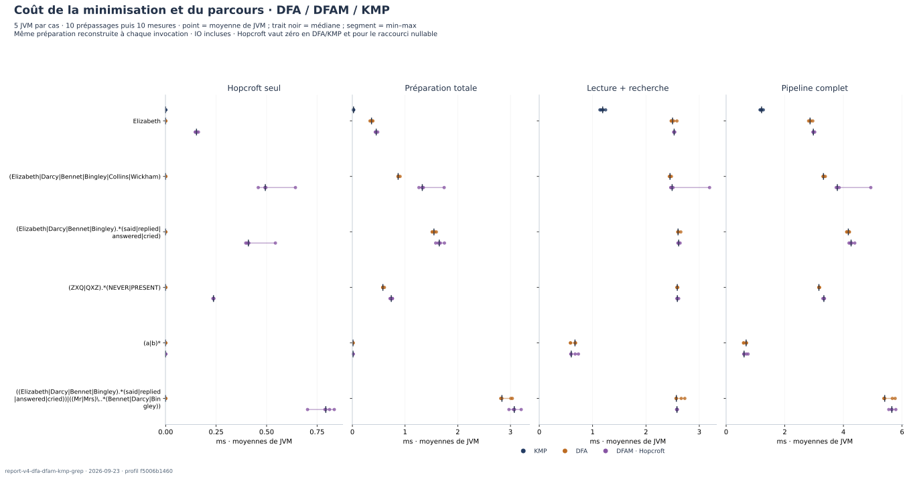
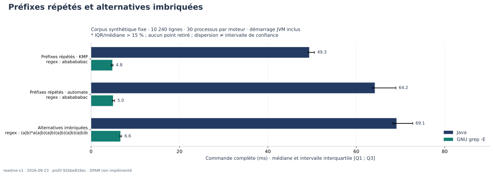
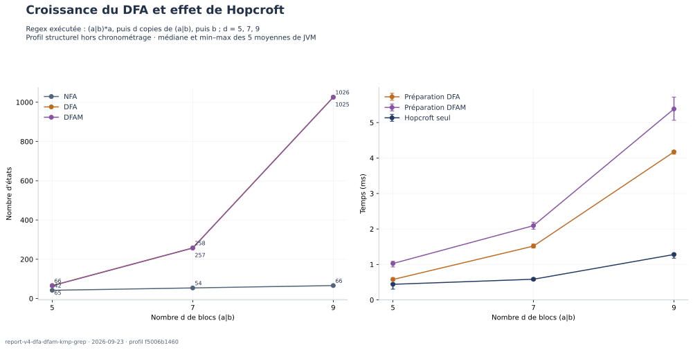

[← Validation](04-validation.md) · [Accueil](../README.md) · [Perspectives →](06-perspectives.md)

# 05 — Comparaison DFA, DFAM, KMP et egrep

Le profil [`report-v4-dfa-dfam-kmp-grep`](../scripts/report-profile.json) mesure le code optimisé avec Hopcroft. Le [rapport chiffré](assets/benchmark.md) compare les moteurs côte à côte ; le [manifeste](assets/benchmark.json) conserve les versions, paramètres, empreintes, tailles et statistiques. Les mesures sont locales à cette machine et ne constituent pas une preuve asymptotique.

## 1. Comparer le même travail

`DFA` construit le NFA puis le DFA de recherche et indexe ses transitions. `DFAM` exécute exactement cette chaîne en ajoutant Hopcroft avant la même indexation. `KMP` est imposé sur les littéraux uniquement. GNU grep est appelé avec `-E`, l’équivalent d’egrep. Tous recherchent une sous-chaîne dans chaque ligne et comptent chaque ligne au plus une fois.

La comparaison à quatre moteurs porte sur `Elizabeth` (livre ×1/×8/×32) et `ababababac` (synthétique). KMP n’est **pas applicable** aux alternatives, wildcards et répétitions : sa case est N/A, jamais un zéro fictif. Pour `(a|b)*`, le pipeline utilise son raccourci commun sans automate ; ce cas ne mesure pas la minimisation. `AUTO` et `AUTOMATON` restent disponibles mais les expériences imposent une stratégie explicite.

## 2. Paramètres fixes et regex exactes

- Java 21, `-Xms64m -Xmx512m -XX:+UseSerialGC -XX:ActiveProcessorCount=1 -Dfile.encoding=UTF-8`.
- Graine CLI `20260923`, JVM `20260924`.
- 32 cas Java, dont 30 cas CLI. Trois prépassages puis cinq blocs de six paires Java/grep : 30 processus mesurés par moteur et cas CLI.
- Cinq JVM par cas, chacune avec dix prépassages puis dix mesures ; chaque invocation reconstruit le motif et lit le fichier.
- Timeout de 60 s par processus CLI et 180 s par fork ou profil structurel.
- Aucun point supprimé. Signalement fixé avant mesure : IQR/médiane > 15 %.

| Groupe | Regex exécutée | Corpus | Stratégies Java |
| :--- | :--- | :--- | :--- |
| literal | `Elizabeth` | book-1 | KMP, DFA, DFAM |
| alternative | `(Elizabeth\|Darcy\|Bennet\|Bingley\|Collins\|Wickham)` | book-1 | DFA, DFAM |
| wildcard | `(Elizabeth\|Darcy\|Bennet\|Bingley).*(said\|replied\|answered\|cried)` | book-1 | DFA, DFAM |
| absent | `(ZXQ\|QXZ).*(NEVER\|PRESENT)` | book-1 | DFA, DFAM |
| nullable | `(a\|b)*` | book-1 | DFA, DFAM |
| complex | `((Elizabeth\|Darcy\|Bennet\|Bingley).*(said\|replied\|answered\|cried))\|((Mr\|Mrs)\..*(Bennet\|Darcy\|Bingley))` | book-1 | DFA, DFAM |
| scale-literal-8 | `Elizabeth` | book-8 | KMP, DFA, DFAM |
| scale-complex-8 | `((Elizabeth\|Darcy\|Bennet\|Bingley).*(said\|replied\|answered\|cried))\|((Mr\|Mrs)\..*(Bennet\|Darcy\|Bingley))` | book-8 | DFA, DFAM |
| scale-literal-32 | `Elizabeth` | book-32 | KMP, DFA, DFAM |
| scale-complex-32 | `((Elizabeth\|Darcy\|Bennet\|Bingley).*(said\|replied\|answered\|cried))\|((Mr\|Mrs)\..*(Bennet\|Darcy\|Bingley))` | book-32 | DFA, DFAM |
| overlap | `ababababac` | synthetic | KMP, DFA, DFAM |
| growth-5 | `(a\|b)*a(a\|b)(a\|b)(a\|b)(a\|b)(a\|b)b` | synthetic | DFA, DFAM |
| growth-7 | `(a\|b)*a(a\|b)(a\|b)(a\|b)(a\|b)(a\|b)(a\|b)(a\|b)b` | synthetic | DFA, DFAM |
| growth-9 | `(a\|b)*a(a\|b)(a\|b)(a\|b)(a\|b)(a\|b)(a\|b)(a\|b)(a\|b)(a\|b)b` | synthetic | DFA, DFAM |

Les cas `growth-9` sont réservés aux JVM échauffées, pour les **deux** stratégies DFA et DFAM. Le livre est la copie `Samples/PrideAndPrejudice.txt`, notices incluses, normalisée en UTF-8/LF puis répétée ×8 et ×32. Son empreinte est fixée dans le profil. Le corpus synthétique contient 2 048 répétitions de cinq lignes : 127 `a` puis `b` ; 128 `a` puis `c` ; 64 copies de `ab` puis `ac` ; 128 `x` ; 32 `é` puis `été`. Chaque ligne se termine par LF.

## 3. Contrôles et unité statistique

Avant de chronométrer, la campagne exécute les tests et compare pour les 32 cas les sorties complètes `Main --print` et `grep -E -n`, octet par octet : mêmes numéros et contenus, pas seulement les mêmes comptes. Les comptes sont revérifiés à chaque invocation. Les textes invalides, NUL ou hors BMP sont exclus du protocole commun. Une différence, une erreur ou un délai dépassé arrête la campagne.

Pour chaque bloc CLI, l’ordre des cas est mélangé. Chaque cas comporte trois paires Java puis grep et trois paires grep puis Java, dans un ordre mélangé. Les durées incluent démarrage JVM, préparation, lecture, recherche et sortie du compteur. Les prépassages CLI sollicitent le cache disque, sans conserver le JIT entre processus. La série grep affichée pour une comparaison est celle du **cas DFA** associé ; les autres séries grep restent dans les CSV, sans mélange opportuniste.

Les mesures internes utilisent cinq JVM distinctes par cas. On calcule d’abord la moyenne des dix mesures d’un fork, puis les statistiques sur les **cinq moyennes** ; les cinquante observations ne sont pas traitées comme indépendantes. Préparation, minimisation et parcours restent séparés. Lecture et décodage sont inclus dans le parcours. Les médianes de phases ne sont pas additives. Les quartiles sont inclusifs et les intervalles affichés décrivent une dispersion, pas un intervalle de confiance.

Les états et arcs NFA/DFA/DFAM sont collectés hors chronométrage, une fois par regex distincte, et recopiés pour ses cas. Ce diagnostic construit aussi les graphes des littéraux KMP et des motifs nullables ; ces constructions ne sont **pas** exécutées par leurs chemins chronométrés. Les sources, classes et corpus sont hachés avant/après ; les résumés sont recalculés depuis les CSV avant tout tracé ou publication.

## 4. Lire les six figures


Chaque groupe utilise le même motif et le même livre ×1. Barres : médianes de processus ; segments : Q1–Q3. L’absence de KMP signifie non applicable.


À gauche, `Elizabeth` compare les quatre moteurs. À droite, la regex complexe compare DFA, DFAM et grep. Le motif reste constant lorsque le corpus grandit.


Les trente processus sont visibles dans leur ordre relatif ; les axes verticaux sont propres à chaque panneau.



Chaque point est la moyenne d’une JVM ; le trait noir est la médiane des cinq moyennes et le segment va du minimum au maximum. Hopcroft vaut zéro pour DFA/KMP et le raccourci nullable.



Motifs : `ababababac`, `(a|b)*a(a|b)(a|b)(a|b)(a|b)(a|b)b` et `(a|b)*a(a|b)(a|b)(a|b)(a|b)(a|b)(a|b)(a|b)b`.



La famille de croissance montre les états avant/après Hopcroft et la préparation totale avec/sans minimisation. Réduire le nombre d’états ne garantit pas un gain global : le coût de minimisation doit être amorti par le parcours. Les trois profondeurs ne démontrent pas une complexité à elles seules.

## 5. Relancer et publier

```bash
./scripts/report-campaign.sh             # arbre propre, tests → mesures → figures → publication
./scripts/report-campaign.sh --allow-dirty # même protocole, résultats locaux avant les commits
./scripts/freeze-report.sh               # publication explicite de cette campagne validée
./scripts/clean-report.sh                # efface les résultats locaux, conserve docs/assets/
```

La publication vérifie les observations, figures et sources, puis remplace les assets ensemble avec sauvegarde/restauration en cas d’échec. `--allow-dirty` ne publie pas automatiquement ; la commande explicite permet de publier avant de créer les commits. Le manifeste garde alors `git_dirty=true`, le commit de départ et les empreintes exactes du code exécuté. Aucun résultat n’est réétiqueté après coup. La campagne exécutée pour cette référence utilise ce mode.

Les données brutes sont locales dans `target/report/results/`, les nouvelles figures dans `target/report/figures/` pour un essai local. Seuls six SVG, `benchmark.md` et `benchmark.json` sont versionnés. `--purge` supprime les CSV/TXT après une publication automatique réussie ; pour garder la possibilité de les auditer, ne pas utiliser cette option. Le nettoyage et `mvn clean` effacent les données locales, pas les assets publiés.

## 6. Limites

Cache système, température, ordonnancement et charge de fond ne sont pas contrôlés. Dix prépassages ne prouvent pas une convergence du JIT. Les chiffres caractérisent ces entrées sur cette machine, sans classement universel. La complexité théorique de Hopcroft est traitée au [chapitre algorithmique](03-algorithmes.md), séparément des observations de temps.

## 7. Résultats de cette exécution

Sur le livre ×1 avec la regex exacte **`Elizabeth`**, les médianes des commandes complètes sont :

| KMP | DFA | DFAM | GNU grep -E |
| ---: | ---: | ---: | ---: |
| 56.11 ms | 87.76 ms | 88.81 ms | 5.72 ms |

Pour la regex complexe écrite dans le tableau des cas, le graphe passe de **159 à 101 états**. Dans les JVM échauffées sur le livre ×1, le total médian des moyennes de forks vaut **7.986 ms avec DFA** et **8.385 ms avec DFAM** ; Hopcroft seul représente une médiane de **0.650 ms**. La réduction structurelle ne produit donc pas ici de gain total médian. Les dispersions et tous les autres cas sont dans le [rapport généré](assets/benchmark.md).

Ces constats restent propres à cette campagne. Ils ne justifient ni de supprimer la minimisation ni d’annoncer qu’elle accélère systématiquement la recherche.
