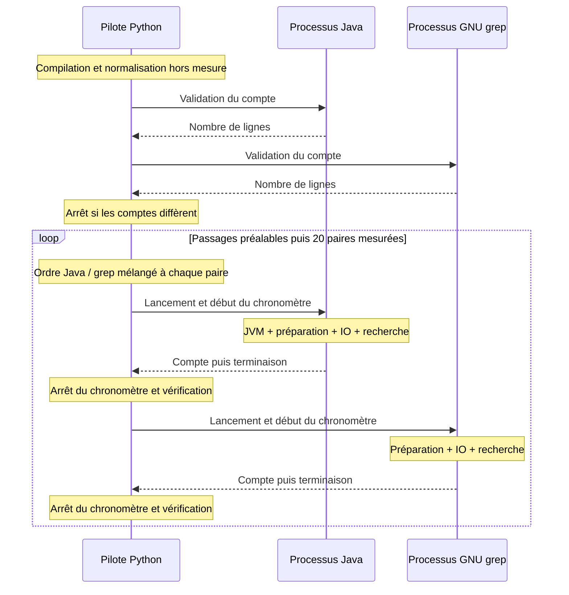
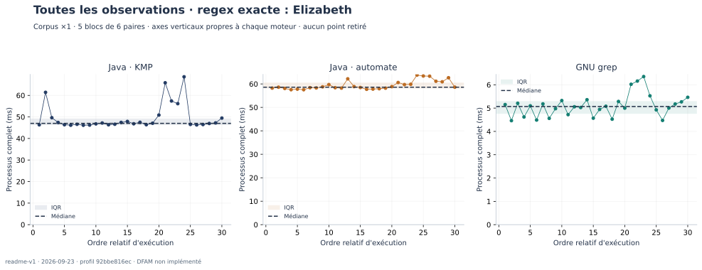

[← Validation](04-validation.md) · [Accueil](../README.md) · [Perspectives →](06-perspectives.md)

# 05 — Mesurer sans changer la question

## 1. Les questions de la campagne

La campagne cherche à éclairer trois points précis : le coût du chemin automate par rapport à KMP sur un même mot, l’effet du volume de texte et l’écart observé avec une commande GNU grep. Elle ne cherche pas à classer tous les moteurs regex ni à établir une loi de performance valable pour toute expression.

Le point de comparaison est un usage en ligne de commande : un fichier, un motif, une exécution qui compte les lignes correspondantes. Ce choix correspond aux scripts disponibles et évite de soustraire artificiellement le démarrage de Java tout en conservant celui de grep.

## 2. Corpus et environnement

Le fichier de base est [`Samples/PrideAndPrejudice.txt`](../Samples/PrideAndPrejudice.txt), une copie de *Pride and Prejudice* de Jane Austen, issue de Project Gutenberg, livre n° 1342 d’après son en-tête. Le document entier est utilisé, notices et en-têtes compris. Les comptes ne décrivent donc pas seulement le corps du roman.

| Paramètre | Valeur de la campagne publiée |
| :--- | :--- |
| Date | 22 septembre 2026, de 20:41:55 à 20:42:39 UTC |
| Système | macOS 26.6.2, architecture arm64 |
| Processeurs logiques annoncés par Python | 12 ; aucun verrouillage d’affinité appliqué |
| JVM | Temurin OpenJDK 21.0.12+8, 64 bits |
| Référence | `ggrep`, GNU grep 3.12, exécuté sur la même machine |
| Pilote de mesure | Python 3.14.7, `time.perf_counter_ns()` |
| Locale des processus | `C.UTF-8` |
| Répétitions | 20 mesures par moteur et par expérience |
| Passages préalables | 3 par moteur, plus un appel de validation par moteur |
| Ordre dans chaque paire | Mélangé avec la graine 42 |
| Minimisation | Non implémentée : `DFAM` retourne son argument |

Il s’agit de GNU grep exécuté **sous macOS**, pas d’une expérience réalisée sur un noyau Linux. Le modèle exact du processeur et la quantité de mémoire ne sont pas renseignés dans cette campagne ; les résultats doivent être considérés comme locaux à cet environnement.

Le fichier original fait **772 386 octets**. La copie UTF-8 avec fins de ligne LF fait **757 471 octets**, pour **14 915 lignes**. Le comparateur traite cette normalisation avant les mesures et donne exactement la même copie aux deux programmes. Elle évite que les CRLF du fichier d’origine soient interprétés différemment par `BufferedReader` et grep.

L’empreinte du fichier original est :

```text
3f6bb9d6f78e0293b56acd4714dd68cb7d6d1d293402031ce9d5a216bcaf9d75
```

Les empreintes du corpus normalisé et de chaque corpus répété se trouvent dans les `metadata.json`. Le [manifeste de campagne](results/2026-09-22/campaign.json) conserve aussi les empreintes des fichiers sources. Le dépôt comportait des modifications non commitées au moment de l’expérience : le hash du commit seul ne suffit donc pas à identifier le code mesuré.

## 3. Ce qui entre dans le chronomètre



Le schéma montre l’ordre Java puis grep pour la lisibilité ; l’ordre réel est enregistré pour chaque mesure dans `runs.csv`.

Les commandes sont `Main --count` et `grep -E -c`. Les sorties sont capturées, sans afficher les lignes du fichier. Pour les deux processus, la durée inclut le lancement, la préparation, les entrées-sorties, la recherche, l’écriture du nombre et l’attente de la terminaison. La validation numérique du résultat est effectuée après l’arrêt du chronomètre.

Chaque appel Java lance une **nouvelle JVM**. Les passages préalables sollicitent le cache du système, mais ne conservent pas un JIT échauffé pour l’appel suivant. Les mesures ne représentent donc ni un service Java déjà chargé ni un benchmark de recherche pure en mémoire.

Le comparateur refuse les regex hors du sous-ensemble commun, les octets UTF-8 invalides, les NUL et les caractères hors BMP. Cette dernière restriction aligne la consommation d’un caractère par le point universel : les moteurs du projet travaillent sur des `char` UTF-16, tandis que grep en locale UTF-8 utilise les caractères décodés.

## 4. Dix expériences, 400 mesures

Les six premières expériences utilisent le corpus de base. Les quatre autres reprennent `Elizabeth` avec des fichiers composés de huit, puis trente-deux copies du même livre.

| Cas | Motif | Chemin Java | Lignes correspondantes, corpus ×1 |
| :--- | :--- | :--- | ---: |
| Littéral | `Elizabeth` | `AUTO`, donc KMP | 644 |
| Même littéral | `Elizabeth` | `AUTOMATON` imposé | 644 |
| Alternative | `Elizabeth\|Darcy` | Automate | 1 050 |
| Point et étoile | `Eli.*beth` | Automate | 644 |
| Motif absent | `ZZZ_NOT_PRESENT_2026` | KMP | 0 |
| Mot vide accepté | `a*` | Automate | 14 915 |

Le cas absent oblige la recherche à conclure à l’absence sur chaque ligne. Le cas `a*` permet au moteur de répondre immédiatement à la réception d’une ligne, puisque son langage contient ε. Le pipeline lit toutefois encore toutes les lignes pour les compter.

L’accord entre `Eli.*beth` et `Elizabeth` sur ce livre ne signifie pas que ces expressions décrivent le même langage. Il s’agit seulement d’un même nombre de lignes correspondantes dans ce corpus.

Les fichiers répétés ont les tailles suivantes :

| Facteur | Octets UTF-8 normalisés | Lignes | Lignes contenant `Elizabeth` |
| :--- | ---: | ---: | ---: |
| ×1 | 757 471 | 14 915 | 644 |
| ×8 | 6 059 768 | 119 320 | 5 152 |
| ×32 | 24 239 072 | 477 280 | 20 608 |

Cette construction garde la distribution des longueurs de lignes et des occurrences. Elle isole mieux le volume qu’une comparaison entre trois livres différents, mais n’apporte aucune diversité linguistique supplémentaire.

## 5. Résultats sur le livre de base


Toutes les valeurs de ce tableau sont des **millisecondes de processus complet**, sous la forme moyenne ± écart type d’échantillon. Les 20 observations de chaque série sont conservées, sans retrait de valeur extrême.

| Cas | Java | GNU grep |
| :--- | ---: | ---: |
| Littéral, KMP | 66,82 ± 5,91 | 5,57 ± 0,29 |
| Littéral, automate imposé | 94,93 ± 2,17 | 5,51 ± 0,36 |
| Alternative | 91,74 ± 1,67 | 5,94 ± 0,31 |
| Point et étoile | 93,50 ± 3,34 | 5,92 ± 0,27 |
| Littéral absent | 81,38 ± 4,60 | 5,42 ± 0,39 |
| Mot vide accepté | 87,63 ± 3,59 | 5,63 ± 0,43 |

Sur `Elizabeth`, KMP est plus rapide que le chemin automate dans cette campagne. Cela concorde avec un coût de préparation plus faible et une recherche sans index de graphe. La mesure complète ne permet pas d’attribuer séparément l’écart à la déterminisation, aux allocations, au JIT ou au parcours : il faudrait répéter et analyser les durées internes pour cela.

Le motif `a*` est instructif. Le moteur préparé sait répondre sans parcourir les caractères, mais la commande prend encore environ 88 ms. Le résultat montre qu’une recherche localement très courte n’annule pas le coût du processus et de la lecture du fichier. Il ne constitue pas une mesure directe du seul démarrage de la JVM.

GNU grep est plus rapide pour tous ces cas. Le manuel décrit plusieurs optimisations possibles selon les motifs, dont des chemins spécialisés pour les chaînes fixes. Nous ne déduisons pas de ces temps quel algorithme interne a été choisi pour une expression donnée. Voir la [section Performance du manuel GNU grep](https://www.gnu.org/s/grep/manual/html_node/Performance.html).

## 6. Effet du volume sur un même motif


La figure utilise la référence grep enregistrée dans les expériences KMP. Les expériences automate contiennent leurs propres répétitions grep, consultables dans les données brutes ; elles ne sont pas fusionnées pour fabriquer une série supplémentaire.

| Corpus | Java KMP | Java automate | GNU grep, campagne KMP |
| :--- | ---: | ---: | ---: |
| ×1 | 66,82 ± 5,91 ms | 94,93 ± 2,17 ms | 5,57 ± 0,29 ms |
| ×8 | 102,74 ± 3,50 ms | 222,05 ± 9,01 ms | 9,37 ± 0,44 ms |
| ×32 | 171,23 ± 4,87 ms | 625,74 ± 32,69 ms | 21,04 ± 0,45 ms |

À ×32, le chemin automate prend environ **3,65 fois** le temps du chemin KMP dans ces exécutions complètes. Les deux retrouvent pourtant les mêmes 20 608 lignes. Cette observation justifie l’intérêt du chemin spécialisé pour ce motif et ce corpus ; elle ne prouve pas que KMP l’emporte sur toute machine et toute distribution de textes.

Multiplier le fichier par 32 ne multiplie pas le temps KMP par 32. C’est compatible avec la présence de coûts fixes et l’évolution de l’exécution pendant un processus plus long. Nous n’ajustons pas de modèle causal sur seulement trois tailles : les segments relient les observations et ne constituent pas une démonstration expérimentale de complexité.

L’analyse théorique établit une recherche préparée linéaire en la longueur du texte. La campagne observe le programme complet, où lecture, allocations, caches et JVM se superposent. Les deux niveaux d’analyse se complètent sans être interchangeables.

## 7. La dispersion compte aussi



Les trois panneaux ont des échelles horizontales différentes, indiquées par leurs axes. Le trait vertical repère la médiane. L’histogramme KMP de cette campagne présente des observations réparties en deux zones ; vingt points ne suffisent pas à en déterminer la cause. Nous conservons cette forme au lieu de résumer les résultats par le meilleur temps.

Pour des observations $t_1,\ldots,t_p$, les indicateurs utilisés sont :

$$
\bar t=\frac{1}{p}\sum_{i=1}^{p}t_i,
\qquad
s=\sqrt{\frac{1}{p-1}\sum_{i=1}^{p}(t_i-\bar t)^2}.
$$

Les barres d’erreur représentent $s$, pas un intervalle de confiance. La médiane est également exportée pour disposer d’un indicateur moins sensible à quelques mesures longues. Aucun test de significativité ni classement probabiliste n’est présenté.

## 8. Menaces sur la validité

**Une seule campagne et une seule machine.** Les résultats ne couvrent pas la diversité des systèmes Linux, des disques ou des JVM. La charge de fond et la politique énergétique n’ont pas été contrôlées. Les expériences ont été exécutées en série, sans benchmarks concurrents lancés par la campagne, mais sans isolement matériel.

**Cache sollicité.** Copier et valider le corpus avant la mesure favorise sa présence dans les caches. Nous ne mesurons pas une lecture disque froide et ne vidons pas le cache du système entre les passages.

**Ordre local, pas campagne entièrement randomisée.** Java et grep changent d’ordre à chaque paire. Les dix expériences, en revanche, suivent un ordre fixe. Une dérive de charge entre le cas KMP et le cas automate reste possible ; répéter plusieurs campagnes dans un ordre différent améliorerait ce point.

**Comparaison de comptes.** Toutes les mesures ont rendu le compte attendu, mais cette égalité ne prouve pas à elle seule l’égalité des ensembles de lignes. Les tests de propriétés complètent cette vérification, et une comparaison des numéros de lignes reste à ajouter.

**Minimisation absente.** Les temps par automate incluent DFAM comme identité. Aucune réduction de nombre d’états n’a été attribuée à cette étape. Les résultats devront être renouvelés après son implémentation.

**Paramètres non étudiés.** La longueur des motifs, la taille du tampon, les cas exponentiels, la consommation mémoire et le temps de chaque phase ne font pas l’objet d’une campagne systématique ici. Le rapport ne leur attribue pas des résultats qui n’ont pas été mesurés.

## 9. Retrouver une mesure et refaire les figures

Les dix sous-dossiers de [`results/2026-09-22/`](results/2026-09-22/) contiennent chacun `runs.csv`, `summary.csv` et `metadata.json`. Les sorties complètes sont conservées dans les fichiers `.txt` voisins. Par exemple :

- [Mesures brutes KMP, corpus ×1](results/2026-09-22/literal-auto/runs.csv) ;
- [Mesures brutes automate, corpus ×32](results/2026-09-22/scale-automaton-32/runs.csv) ;
- [Configuration de l’expérience avec alternative](results/2026-09-22/alternative/metadata.json) ;
- [Manifeste de la campagne](results/2026-09-22/campaign.json).

```bash
./scripts/report-campaign.sh target/rapport-reproduction --runs 20
```

Le script refuse d’écraser un dossier existant. Il ne cherche pas à reproduire exactement les mêmes nanosecondes ; il reproduit le corpus, les motifs, les règles de comparaison et le nombre de passages.

Les figures sont produites avec [Matplotlib](https://matplotlib.org/stable/users/explain/quick_start.html) par [`scripts/plot-report.py`](../scripts/plot-report.py). Le programme lit les CSV, sans recalculer ni modifier les mesures. Les exports SVG permettent l’intégration au rapport ; les PNG facilitent l’inspection et l’usage dans d’autres éditeurs. L’environnement optionnel de tracé est décrit dans le [guide d’utilisation](01-utilisation.md#5-reproduire-toute-la-campagne-du-rapport).

[← Validation](04-validation.md) · [Accueil](../README.md) · [Perspectives →](06-perspectives.md)
